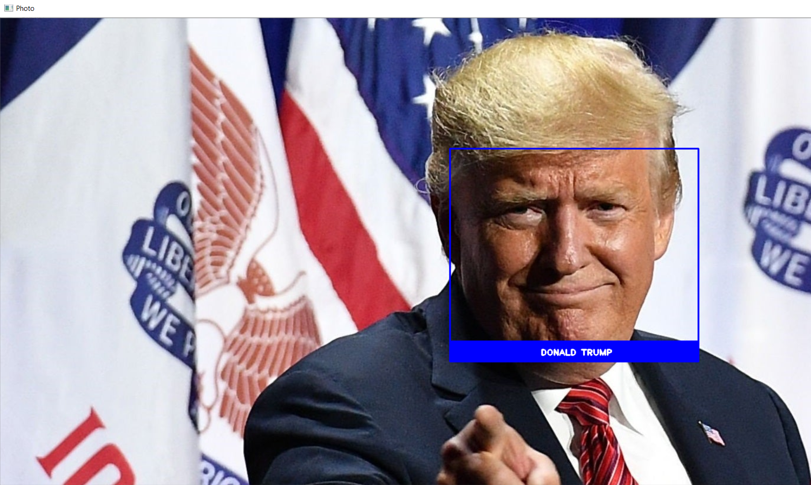
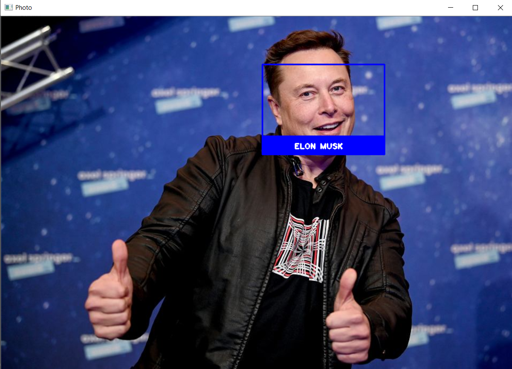

# This Project is Build With Face_Recognition Library in Python

* This function helps us to recognize if there is a face in a photo or not. First, I trained the model with the photos in the faces folder. 

* The model found the locations of the faces in those pictures and I store them into a dictionary with the name of the pictures.

* Then, I give the photo that I use for the testing. What the model exactly do is to find the locations of the faces from the test photo and compare them with the locations that I've stored before.

* The model finds the closest distance and predicts with using the testing photo. Labels for the predictions that I've used are the names of the picture files.

* Sometimes, the size of pictures could be bad for the predicting and drawing a rectangle to the face. So, I decided to use (800, 600) for the horizontal pictures and (600, 1000) for the vertical pictures.

* And due to resizing the image, sometimes the picture could be rotated. So I've used rotate function to make them rotate back.

-This is the picture of Donald Trump that I've used for training the model:

-And this is the result of the testing:

-This is another testing for the Elon Musk's photo. Trained photo:

-And the result:

